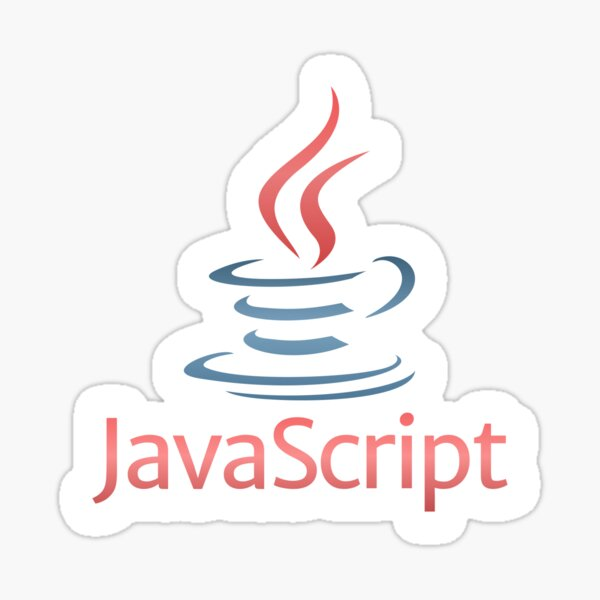
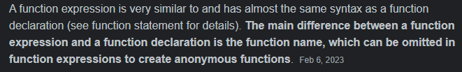
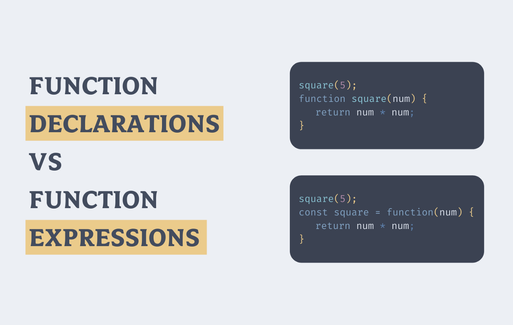
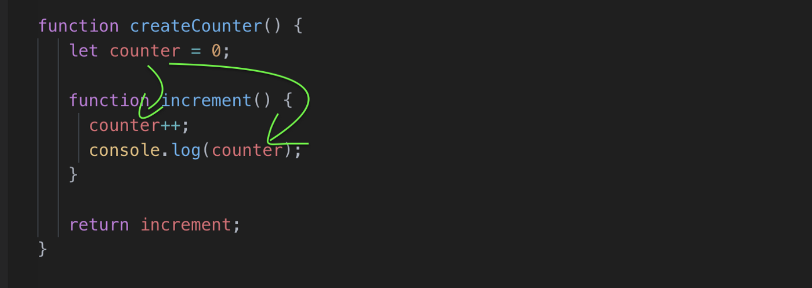

## 1-)Function
## 2-)Scope
## 3-)Hosting
## 4-)Recursion & Closure

# Lets Start Dont be Scared

### Function Decloration & Expression Difference

#### Functions Example 

### Scope in JavaScript refers to the current context of code, which determines the accessibility of variables to JavaScript. The two types of scope are local and global: Global variables are those declared outside of a block. Local variables are those declared inside of a block

## Hosting

### JavaScript Hoisting refers to the process whereby the interpreter appears to move the declaration of functions, variables or classes to the top of their scope, prior to execution of the code. Hoisting is not a term normatively defined in the ECMAScript specification

## Recursion
### Lets see Example

## Description
### Recursion is a programming pattern or concept embedded in many programming languages, and JavaScript is not left out. It is a feature used in creating a function that keeps calling itself but with a smaller input every consecutive time until the code's desired result from the start is achieved.

## Closure

### A closure is the combination of a function bundled together (enclosed) with references to its surrounding state (the lexical environment).  In other words, a closure gives you access to an outer function's scope from an inner function.

# Presentation.
## 1st Java Lesson..

## Clone open HTML go Live..

## U can connect through your phone too..
